

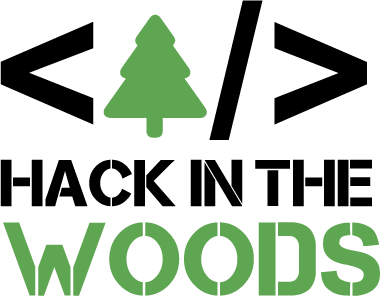

# Menu

* [Hack in the Woods](#Hack-in-the-woods-v2.0-2019)
* [Team Onepoint](#Equipe-Onepoint.)
* [Projet Natagora](#Projet)
* [Solution proposée](#Solution-proposée)
* [Déploiement solution](#Déployer-le-projet)
* [To-Do](#TODO)
* [License](#License)

# Hack in the woods v2.0 2019

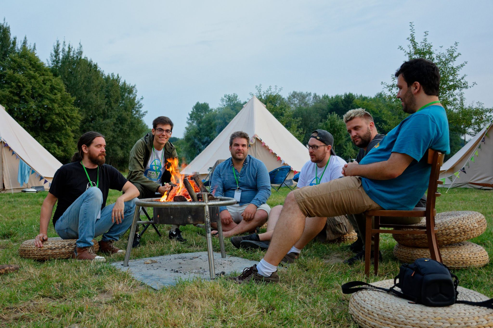

Le Hack in the Woods est un festival-hackaton éco-responsable organisé par le Microsoft Innovation Center au domaine de Graux à Tournai. Il a eu lieu du 1 aout 2019 jusqu'au 4 aout 2019, c'était la deuxième itération de l'évènement en pleine nature. Cette année, c'est plus de 250 personnes qui étaient présentes pour trouver une solution aux 15 projets proposés par les ONG's.

# Equipe Onepoint.

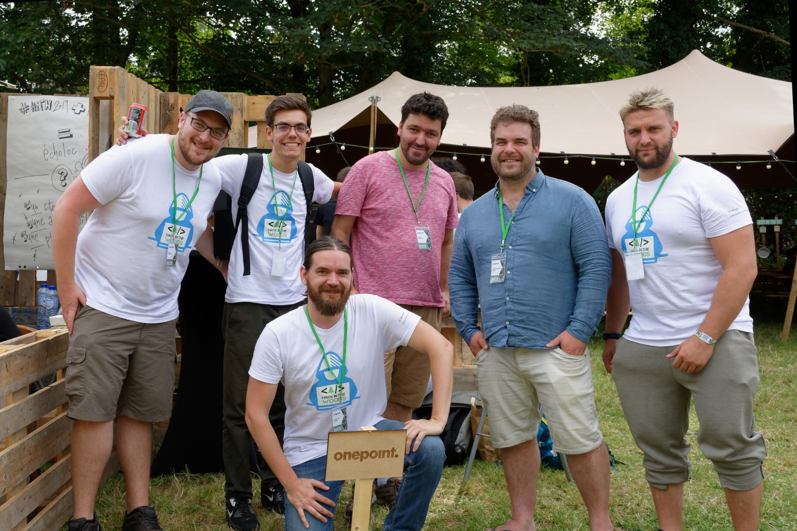

    L'équipe Onepoint était composée de 6 personnes:
    - Benjamin THYS - Développeur
    - Cyrille CATHELAIN - Développeur
    - Julien VANDERAUWERA - Développeur
    - Jonathan WINNIK - Développeur
    - Christian VERDE - Développeur
    - Loris Rossi - Développeur

# Projet 

Les équipes ont quatre jours pour développer une solution concrète et innovante aux challenges proposés par les organismes humanitaires.

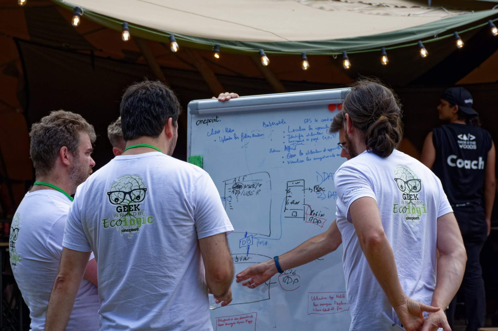

Nous avons sélectionné le projet de Natagora surnommé Batman. La problématique est la suivant: le transfert des enregistrements audios de chauves souris provenant des capteurs n'est pas optimal et parfois très lent (1 ans d'attente). L'encodage des métadonnées des poses des capteurs est encore manuel et une visualisation des endroits de poses pourrait grandement les aider à mieux s'organiser et accélérer le traitement. Notre équipe s'est penchée sur ces besoins pour proposer une solution viable et innovante en 3 jours.
    

# Solution proposée

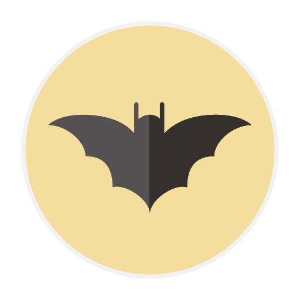

Notre équipe a répondu aux problèmes majeurs de Natagora: 

    - Le Transfert des données audios provenant des capteurs 
    - L'encodage des métadonnées des capteurs
    - La visualisation des endroits de poses

Notre solution est composé de trois applications, une application mobile pour la récupération des infos de poses sur le terrain pour les volontaires (Batmobile), un client s'exécutant sur la machine du volontaire pour uploader les fichiers des cartes SD des capteurs (Client Robin) et une web app proposant une interface pour les administrateurs afin de consulter les enregistrements, leurs métadonnées, les endroits de poses, les appareils et les collaborateurs (Alfred).

# Déployer le projet

- Mettre en place une base de données CouchDB
- Obtenir une clé d'API Google Map pour la carte

# TODO

- Intégration fonctionnalités RGPD pour les utilisateurs
- Corrections de bogues (batmobile) pour envoi des données du formulaire
- Rendre interface graphique plus intuitive
- Renforcer la securité

# License

Ce projet est sous la license MIT

# Captures d'ecrans

## Alfred

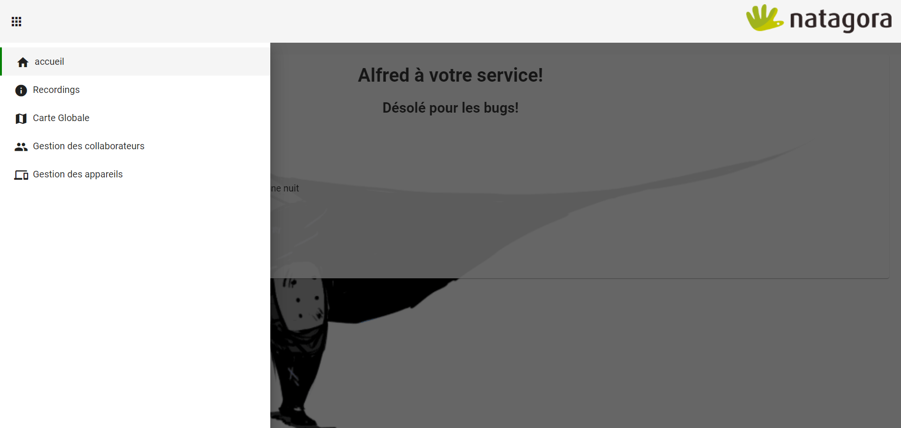

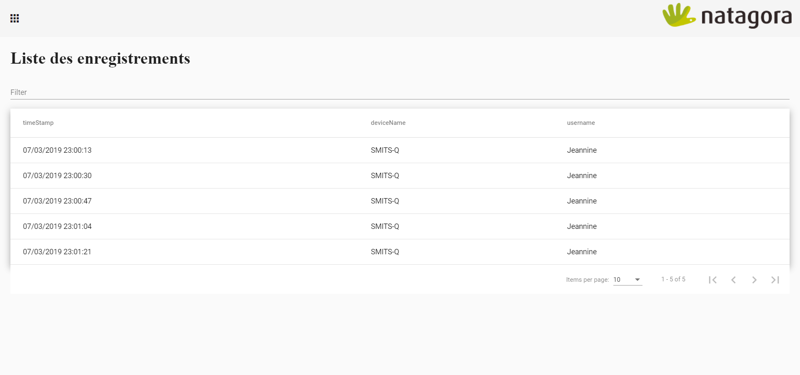

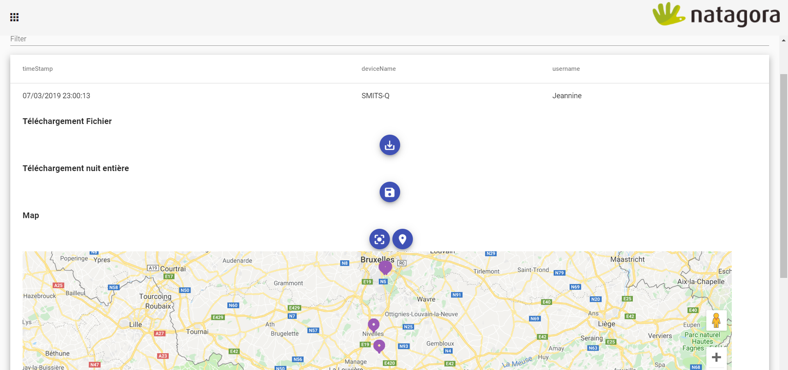

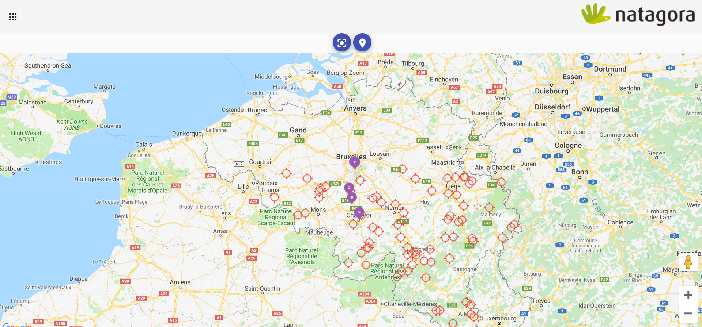

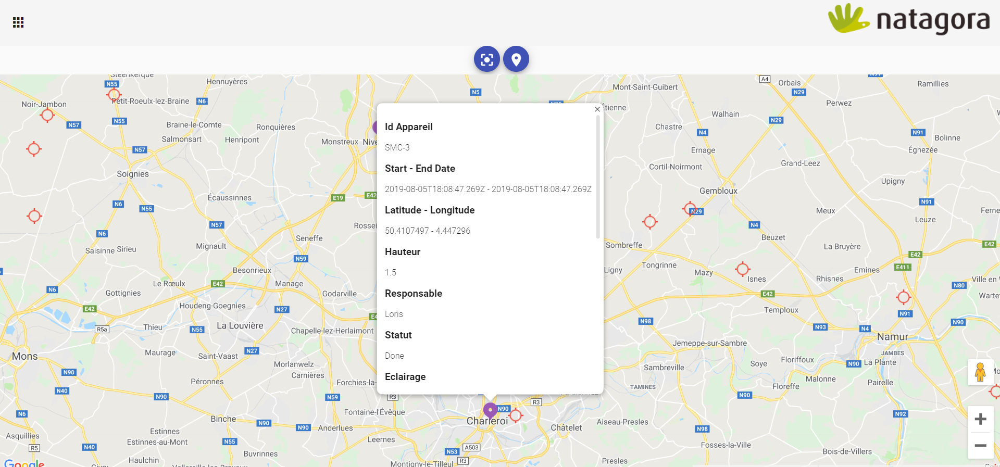

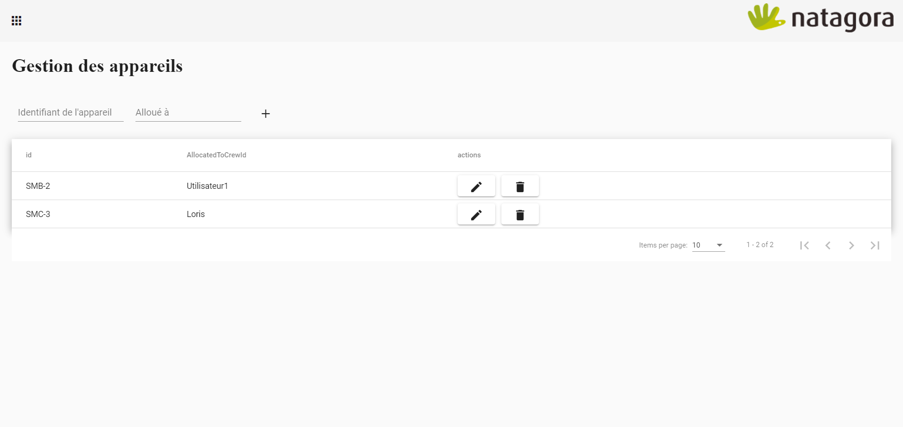

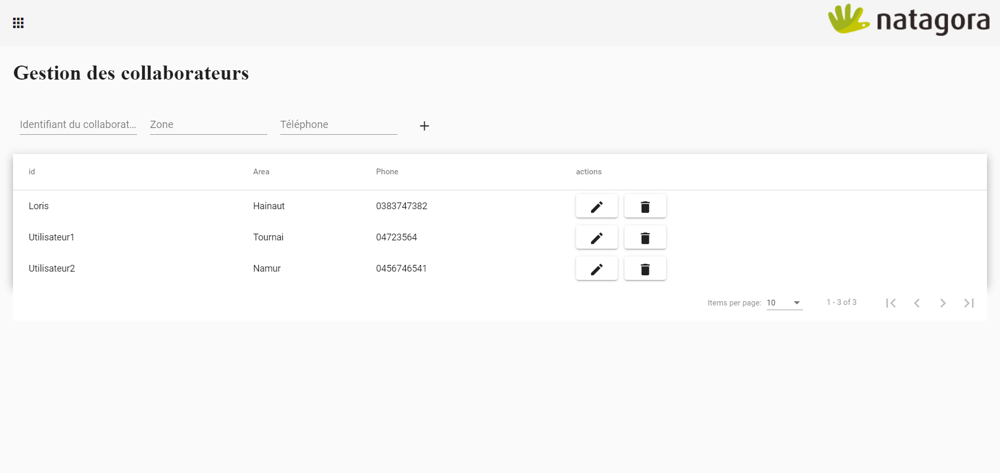

## Batmobile

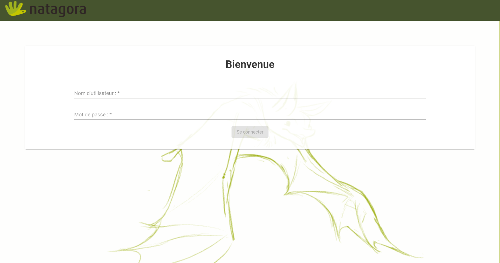

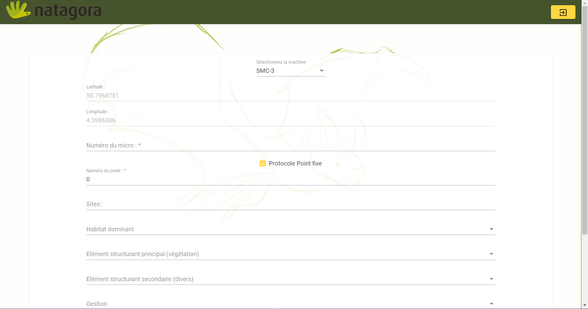

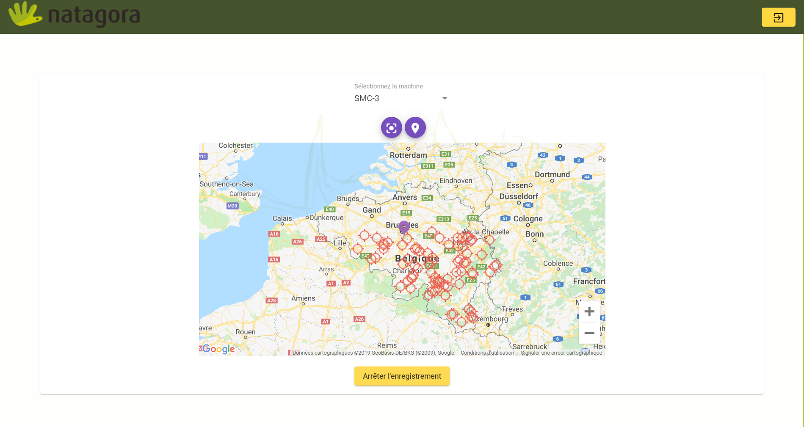

## Robin

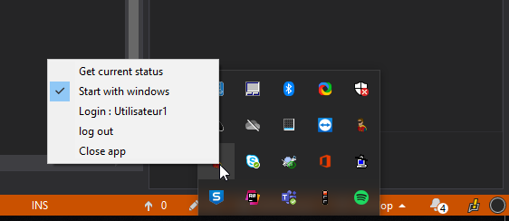

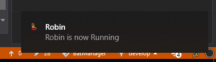